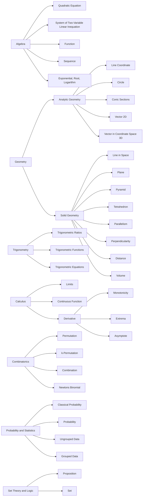

# Math

## Structure

- [Sequence](267mkupr.md)
- [Recurrence](ixm5vvqu.md)
- [Expo - Root - Log](mw5x0c99.md)

- [Repetitive Permutation](06t4hd5h.md)

## Problemsets

- [Advanced Problem](i1mfwy58.md)

## High school roadmap

## Sourced roadmaps

## My roadmap

```mermaid
graph LR
Logic_sets --> Proposition
Logic_sets --> Set
Logic_sets --> Predicate
Logic_sets --> Proof_techniques

Algebra --> System_of_two_variable_linear_inequation
Algebra --> Quadratic_equation
Algebra --> Polynomial
Algebra --> Function
Algebra --> Sequence
Algebra --> Expo_root_log
Algebra --> Complex_numbers
Complex_numbers --> Argand_diagram
Complex_numbers --> Modulus_argument
Complex_numbers --> De_moivre
Complex_numbers --> Roots_of_unity

Algebra --> Limits
Limits --> Asymptote
Algebra --> Continuous_function
Algebra --> Derivative
Derivative --> Monotonicity
Derivative --> Extrema

Linear_algebra --> Matrix
Matrix --> Matrix_operations
Matrix --> Determinant
Matrix --> Inverse
Matrix --> Rank
Matrix --> Eigenvalue_eigenvector
Matrix --> Diagonalization
Linear_algebra --> Linear_system
Linear_algebra --> Vector_space
Vector_space --> Basis_dimension
Vector_space --> Linear_transformation

Calculus --> Limits
Calculus --> Continuity
Calculus --> Derivative
Derivative --> Rules_of_differentiation
Derivative --> Implicit_differentiation
Derivative --> Applications
Applications --> Monotonicity
Applications --> Extrema
Applications --> Concavity
Calculus --> Integral
Integral --> Indefinite_integral
Integral --> Definite_integral
Integral --> Techniques
Techniques --> Substitution
Techniques --> Parts
Techniques --> Partial_fractions
Integral --> Area_volume
Calculus --> Multivariable_calculus
Multivariable_calculus --> Partial_derivative
Multivariable_calculus --> Gradient
Multivariable_calculus --> Multiple_integral
Multivariable_calculus --> Vector_calculus
Vector_calculus --> Divergence
Vector_calculus --> Curl
Vector_calculus --> Line_integral

Differential_equations --> ODE
ODE --> First_order
ODE --> Second_order_linear
ODE --> Systems_of_odes
Differential_equations --> PDE

Trigonometry --> Trigonometry_basics
Trigonometry --> Trigonometric_function_and_equation

Geometry --> Vector_2d
Geometry --> Coordinate_plane
Coordinate_plane --> Line_2d
Coordinate_plane --> Circle
Coordinate_plane --> Conic_sections
Geometry --> Spatial_geometry
Spatial_geometry --> Line_in_space
Spatial_geometry --> Plane
Spatial_geometry --> Pyramid
Spatial_geometry --> Tetrahedron
Spatial_geometry --> Parallelism
Spatial_geometry --> Perpendicularity
Spatial_geometry --> Distance
Spatial_geometry --> Volume
Geometry --> Vector_3d

Probability --> Combinatorics
Combinatorics --> Permutation
Combinatorics --> Partial_permutation
Combinatorics --> Combination
Probability --> Newton_binomial
Probability --> Classical_probability
Probability --> Conditional_probability
Probability --> Bayes
Probability --> Random_variables
Probability --> Distributions
Distributions --> Binomial
Distributions --> Normal
Distributions --> Poisson
Probability --> Expectation_variance

Statistics --> Ungrouped_data
Statistics --> Grouped_data
Statistics --> Descriptive_statistics
Descriptive_statistics --> Mean
Descriptive_statistics --> Median
Descriptive_statistics --> Mode
Descriptive_statistics --> StdDev
Statistics --> Inferential_statistics
Inferential_statistics --> Hypothesis_testing
Inferential_statistics --> Confidence_intervals
Inferential_statistics --> Regression

Real_analysis --> Sequences_series
Real_analysis --> Metric_spaces
Real_analysis --> Convergence
Real_analysis --> Continuity_rigorous

Numerical_methods --> Root_finding
Numerical_methods --> Numerical_integration
Numerical_methods --> Linear_system_solvers

Applied_math
Discrete_math
Number_theory
Abstract_algebra
```

## ChatGPT roadmap

```mermaid
graph LR
Logic_Sets --> Proposition
Logic_Sets --> Predicate_Logic
Logic_Sets --> Set_Theory
Set_Theory --> Axiomatic_Set_Theory
Set_Theory --> Set_Operations
Logic_Sets --> Proof_Techniques
Proof_Techniques --> Mathematical_Induction
Proof_Techniques --> Proof_by_Contradiction
Proof_Techniques --> Constructive_Proof

Algebra --> Elementary_Algebra
Elementary_Algebra --> Linear_Equations_Inequalities
Elementary_Algebra --> Quadratic_Equations
Elementary_Algebra --> Polynomials
Elementary_Algebra --> Functions_Relations
Elementary_Algebra --> Sequences_Series
Elementary_Algebra --> Exponents_Roots_Logarithms
Elementary_Algebra --> Complex_Numbers
Complex_Numbers --> Argand_Diagram
Complex_Numbers --> Modulus_Argument
Complex_Numbers --> De_Moivre_Theorem
Complex_Numbers --> Roots_of_Unity
Algebra --> Abstract_Algebra
Abstract_Algebra --> Group_Theory
Abstract_Algebra --> Ring_Theory
Abstract_Algebra --> Field_Theory
Abstract_Algebra --> Galois_Theory
Abstract_Algebra --> Representation_Theory
Abstract_Algebra --> Homological_Algebra
Abstract_Algebra --> Category_Theory

Linear_Algebra --> Vectors_Vector_Spaces
Linear_Algebra --> Matrices
Matrices --> Matrix_Operations
Matrices --> Determinant
Matrices --> Matrix_Inverse
Matrices --> Matrix_Rank
Matrices --> Eigenvalues_Eigenvectors
Matrices --> Diagonalization
Linear_Algebra --> Linear_Systems
Linear_Algebra --> Linear_Transformations

Calculus_Analysis --> Differential_Calculus
Differential_Calculus --> Limits_Continuity
Differential_Calculus --> Derivatives
Derivatives --> Differentiation_Rules
Derivatives --> Implicit_Differentiation
Derivatives --> Applications_of_Derivative
Applications_of_Derivative --> Monotonicity
Applications_of_Derivative --> Extrema_Max_Min
Applications_of_Derivative --> Concavity_Inflection
Differential_Calculus --> Trigonometry_in_Calculus
Calculus_Analysis --> Integral_Calculus
Integral_Calculus --> Indefinite_Integrals
Integral_Calculus --> Definite_Integrals
Integral_Calculus --> Integration_Techniques
Integration_Techniques --> Substitution
Integration_Techniques --> Integration_by_Parts
Integration_Techniques --> Partial_Fractions
Integral_Calculus --> Area_Volume
Calculus_Analysis --> Real_Analysis
Real_Analysis --> Infinite_Sequences_Series
Real_Analysis --> Continuity_Epsilon_Delta
Real_Analysis --> Convergence_Uniform_Pointwise
Real_Analysis --> Metric_Spaces
Real_Analysis --> Measure_Integration
Calculus_Analysis --> Complex_Analysis
Complex_Analysis --> Holomorphic_Functions
Complex_Analysis --> Cauchy_Theorem
Complex_Analysis --> Residue_Calculus
Calculus_Analysis --> Multivariable_Calculus
Multivariable_Calculus --> Partial_Derivatives
Multivariable_Calculus --> Gradient_Divergence
Multivariable_Calculus --> Multiple_Integrals
Multivariable_Calculus --> Vector_Calculus
Vector_Calculus --> Divergence
Vector_Calculus --> Curl
Vector_Calculus --> Line_Integrals
Calculus_Analysis --> Differential_Equations
Differential_Equations --> Ordinary_DEs
Ordinary_DEs --> First_Order_ODEs
Ordinary_DEs --> Second_Order_ODEs
Ordinary_DEs --> Systems_of_ODEs
Differential_Equations --> Partial_Differential_Equations
Differential_Equations --> Dynamical_Systems
Calculus_Analysis --> Functional_Analysis
Functional_Analysis --> Normed_Banach_Spaces
Functional_Analysis --> Hilbert_Spaces
Functional_Analysis --> Linear_Operators
Functional_Analysis --> Spectral_Theory

Geometry_Topology --> Euclidean_Geometry
Euclidean_Geometry --> Plane_Geometry
Euclidean_Geometry --> Classical_Theorems
Geometry_Topology --> Analytic_Geometry
Analytic_Geometry --> 2D_Lines
Analytic_Geometry --> Circles
Analytic_Geometry --> Conic_Sections
Geometry_Topology --> Solid_Geometry
Solid_Geometry --> Planes_in_Space
Solid_Geometry --> Lines_in_Space
Solid_Geometry --> Polyhedra_Pyramid_Tetrahedron
Solid_Geometry --> Distance_Formulas
Solid_Geometry --> Volume_of_Solids
Geometry_Topology --> Differential_Geometry
Differential_Geometry --> Curves_Surfaces
Differential_Geometry --> Manifolds
Differential_Geometry --> Gauss_Theorema_Egregium
Geometry_Topology --> Topology
Topology --> General_Topology
Topology --> Algebraic_Topology
Topology --> Geometric_Topology
Topology --> Knot_Theory
Geometry_Topology --> Lie_Groups_Algebras

Probability_Statistics --> Probability_Theory
Probability_Theory --> Combinatorics
Combinatorics --> Permutations
Combinatorics --> Combinations
Combinatorics --> Binomial_Theorem
Probability_Theory --> Classical_Probability
Probability_Theory --> Conditional_Probability
Probability_Theory --> Bayes_Theorem
Probability_Theory --> Random_Variables
Probability_Theory --> Probability_Distributions
Probability_Distributions --> Binomial_Distribution
Probability_Distributions --> Normal_Gaussian_Distribution
Probability_Distributions --> Poisson_Distribution
Probability_Distributions --> Other_Distributions
Probability_Theory --> Expectation_Variance
Probability_Theory --> Stochastic_Processes
Stochastic_Processes --> Markov_Processes
Probability_Statistics --> Statistics
Statistics --> Descriptive_Statistics
Descriptive_Statistics --> Mean
Descriptive_Statistics --> Median
Descriptive_Statistics --> Mode
Descriptive_Statistics --> Standard_Deviation
Statistics --> Inferential_Statistics
Inferential_Statistics --> Hypothesis_Testing
Inferential_Statistics --> Confidence_Intervals
Inferential_Statistics --> Regression_Correlation
Statistics --> Time_Series_Analysis
Statistics --> Econometrics

Discrete_Mathematics_CS --> Mathematical_Logic
Discrete_Mathematics_CS --> Elementary_Number_Theory
Elementary_Number_Theory --> Divisibility_Primes
Elementary_Number_Theory --> Modular_Arithmetic
Elementary_Number_Theory --> Diophantine_Equations
Elementary_Number_Theory --> Algebraic_Number_Theory
Discrete_Mathematics_CS --> Graph_Theory
Discrete_Mathematics_CS --> Combinatorics
Combinatorics --> Combinatorial_Designs
Combinatorics --> Coding_Theory
Discrete_Mathematics_CS --> Automata_Formal_Languages
Discrete_Mathematics_CS --> Complexity_Algorithms
Complexity_Algorithms --> Recurrence_Relations
Complexity_Algorithms --> Recursion_Computability
Complexity_Algorithms --> Cryptography
Complexity_Algorithms --> Information_Theory

Applied_Computational_Math --> Optimization
Optimization --> Linear_Programming
Optimization --> Nonlinear_Optimization
Optimization --> Calculus_of_Variations
Applied_Computational_Math --> Numerical_Methods
Numerical_Methods --> Root_Finding
Numerical_Methods --> Numerical_Integration
Numerical_Methods --> Linear_System_Solvers
Numerical_Methods --> Numerical_Linear_Algebra
Numerical_Methods --> Numerical_PDEs
Applied_Computational_Math --> Simulation_Monte_Carlo
Applied_Computational_Math --> Signal_Processing
Applied_Computational_Math --> Control_Theory
Applied_Computational_Math --> Operations_Research
Applied_Computational_Math --> Mathematical_Physics
Applied_Computational_Math --> Mathematical_Biology
Applied_Computational_Math --> Mathematical_Finance
```

