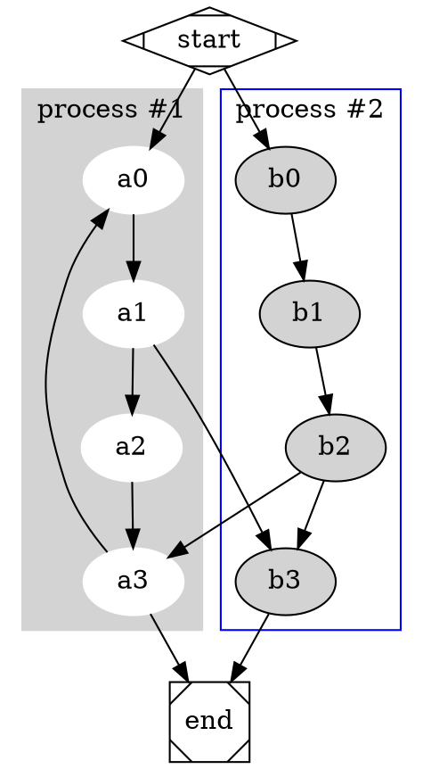
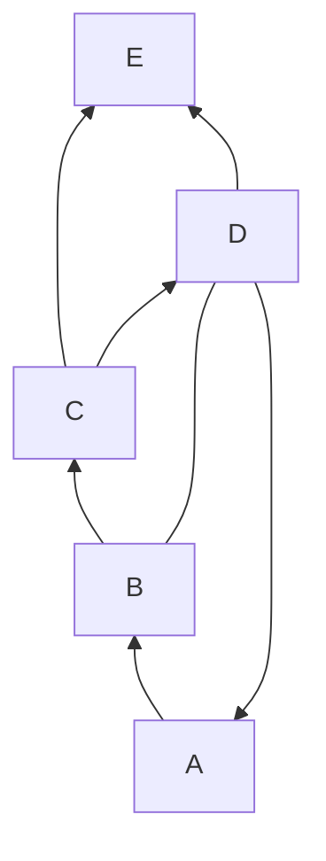

# Graphs In This Repo

$$
\pi+\pi=5
$$

```flowchart
st=>start: Start
op=>operation: Do something
e=>end: End
st->op->e
```



<svg width="200" height="200" viewBox="0 0 200 200">
  <polygon points="50,50 50,150 150,150" fill="lightblue" stroke="black" stroke-width="2"/>
</svg>





```dot
digraph RightTriangle {
  node [shape=circle, width=0.2, fixedsize=true];

  A [label="A", pos="0,0!"];
  B [label="B", pos="5,0!"];
  C [label="C", pos="5,0!"];

  A -> B [dir=none];
  A -> C [dir=none];
  B -> C [dir=none];

  graph [splines=false, nodesep=0.5, ranksep=0.5];
}
```

```plantuml
Alice-Bob: Hello
Bob-Alice: Hi
Bob--Alice: Hii
Alice--Bob: Halloo

Alice->Bob: Hello
Bob->Alice: Hi
Bob-->Alice: Hii
```

```sequence-diagrams
Alice-Bob: Hello
Bob-Alice: Hi
Bob--Alice: Hii
Alice--Bob: Halloo

Alice-Bob: Hello
Bob-Alice: Hi
Bob--Alice: Hii
Alice--Bob: Halloo
```

```chart
{
    "type": "pie",
    "data": {
        "labels": [
            "Red",
            "Blue",
            "Yellow"
        ],
        "datasets": [
            {
                "data": [
                    300,
                    50,
                    100
                ],
                "backgroundColor": [
                    "red",
                    "blue",
                    "#fc5"
                ]
            },
            {
                "data": [
                    300,
                    50,
                    500
                ],
                "backgroundColor": [
                    "red",
                    "blue",
                    "#fc5"
                ]
            }
        ]
    }
}
```

<svg xmlns="http://www.w3.org/2000/svg" width="200" height="200" viewBox="0 0 200 200">
  <polygon points="50,150 50,50 150,150" fill="none" stroke="black" stroke-width="2"/>
  <circle cx="50" cy="150" r="4" fill="red"/>
  <circle cx="50" cy="50" r="4" fill="red"/>
  <circle cx="150" cy="150" r="4" fill="red"/>
  <text x="45" y="175" font-size="16" fill="black">A</text>
  <text x="45" y="40" font-size="16" fill="black">B</text>
  <text x="155" y="175" font-size="16" fill="black">C</text>
</svg>

<iframe src="https://www.desmos.com/calculator/wtk53nb3wm?fontSize=14" width="100%" height="500"/>
