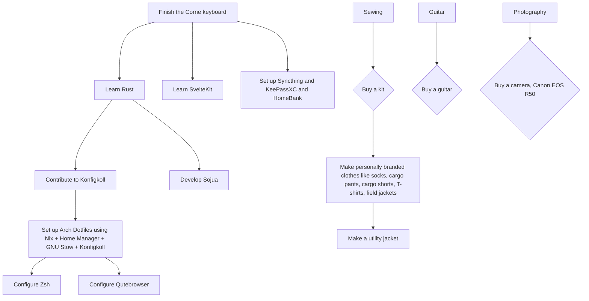
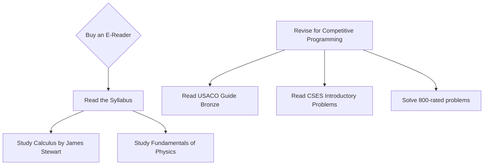
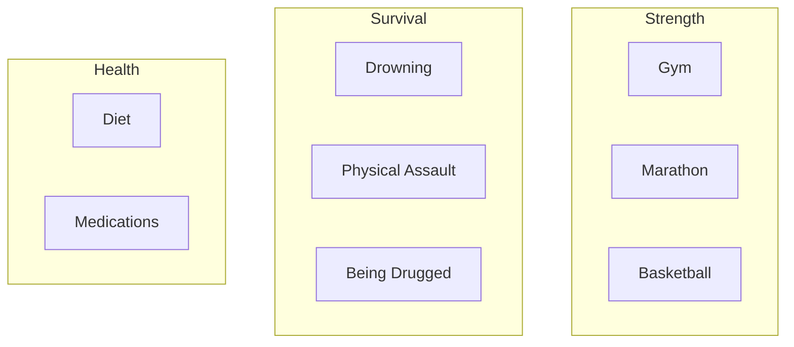

# To-do

## Graph

### For my passion

### For my career

### For myself

## List

- [ ] Coding
    - [ ] Review Tai's DMs on Instagram for coding knowledge
    - [ ] Rewrite PokumeKachi.web.app
    - [ ] Write my own Lua-Rust hybrid programming language
    - [ ] Work on LoiMon.com
    - [ ] Write a NeoVim plugin providing visual feedback when completing a keymap

- Linux tinkering
    - [ ] Write a WM in Smithay
    - [ ] Setup lesspipe
    - [ ] Setup kitty images in NeoVim
    - [ ] Clean NeoVim config
    - [ ] Try QuickShells out (Noctalia, Caelestia)
    - [ ] Write HTMX web server for my ThinkPad T410
    - [ ] Maybe learn Helix Text Editor
    - [ ] SHOP new WiFi card
    - [ ] SHOP VPS
    - [ ] SHOP Domain name

- Hobby
    - [ ] PROJECT Design my own ergomech keyboard
    - [ ] Clean up YouTube Watch later
