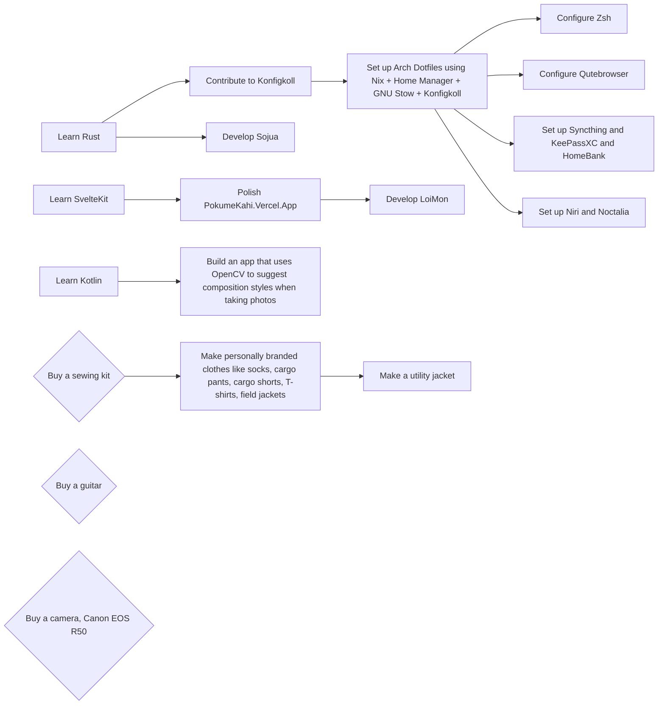
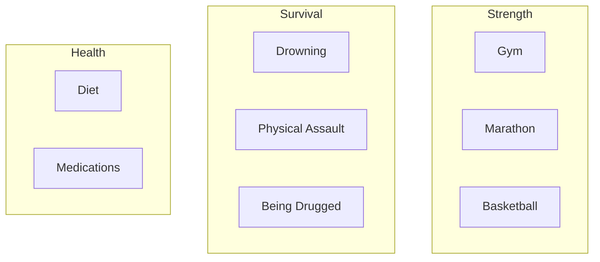

# To-do

## Graph

### For my passion

- Instead of Konfigkoll we have the options of pyinfra, Ansible, Salt, Puppet, Chef, Fabric

### For myself

## List

- [ ] Coding
    - [ ] Write my own Lua-Rust hybrid programming language

- Linux tinkering
    - [ ] Write a WM in Smithay
    - [ ] Setup lesspipe
    - [ ] Setup kitty images in NeoVim
    - [ ] Write HTMX web server for my ThinkPad T410
